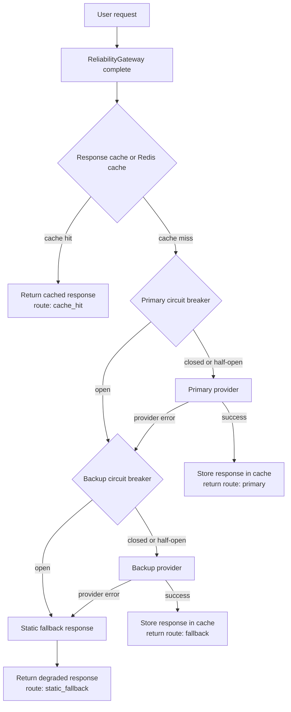

# Day 10 Reliability Final Report

## Architecture



## Configuration

| Parameter | Value | Rationale |
|---|---:|---|
| primary fail_rate | 0.25 | Baseline chaos includes a meaningfully flaky primary. |
| backup fail_rate | 0.05 | Backup is more reliable but not perfect, so static fallback remains tested. |
| failure_threshold | 3 | Opens after repeated failures without overreacting to one transient error. |
| reset_timeout_seconds | 2 | Lets the breaker recover during the load test window. |
| success_threshold | 1 | One successful probe closes HALF_OPEN for a short lab simulation. |
| cache backend | memory | Default run is local and reproducible; Redis is separately tested with Docker. |
| cache ttl_seconds | 300 | Keeps repeated sample queries hot during chaos runs. |
| similarity_threshold | 0.92 | Conservative threshold to reduce semantic false hits. |
| load_test.requests | 100 per scenario | Enough requests to trigger breaker/cache behavior quickly. |

## SLO Definitions

Latency is measured end-to-end around `gateway.complete()`, so P50/P95/P99 include cache hits, primary provider calls, fallback provider calls, and static fallback responses.

| SLI | SLO target | Actual value | Met? |
|---|---|---:|---|
| Availability | >= 95% | 98.33% | yes |
| Latency P95 | < 2500 ms | 502.92 ms | yes |
| Fallback success rate | >= 90% | 93.98% | yes |
| Cache hit rate | >= 10% | 58.00% | yes |
| Recovery time | < 5000 ms | 2463.76 ms | yes |

## Metrics Summary

These metrics are from the with-cache run stored in `reports/metrics.json`. Percentiles are end-to-end request latency, not provider-only latency.

| Metric | Value |
|---|---:|
| total_requests | 300 |
| availability | 0.9833 |
| error_rate | 0.0167 |
| latency_p50_ms | 1.04 |
| latency_p95_ms | 502.92 |
| latency_p99_ms | 529.84 |
| fallback_success_rate | 0.9398 |
| cache_hit_rate | 0.58 |
| circuit_open_count | 9 |
| recovery_time_ms | 2463.762044906616 |
| estimated_cost | 0.051806 |
| estimated_cost_saved | 0.174 |

## Chaos Scenarios

| Scenario | Expected | Observed | Status |
|---|---|---|---|
| primary_timeout_100 | Primary fails; backup handles most traffic. | fallback_success_rate stayed above 0.9. | pass |
| primary_flaky_50 | Circuit opens during failures and gateway still serves traffic. | circuit_open_count was non-zero and availability stayed above 0.8. | pass |
| all_healthy | Normal primary/cache path should dominate. | availability stayed above 0.9. | pass |

## Cache Comparison

The simulation was run twice with the same provider and circuit-breaker settings: once with cache enabled and once with cache disabled. Latency percentiles include both cache and LLM paths.

| Metric | With cache | Without cache | Difference |
|---|---:|---:|---:|
| total_requests | 300 | 300 | 0 |
| availability | 0.9833 | 0.95 | +0.0333 |
| error_rate | 0.0167 | 0.05 | -0.0333 |
| latency_p50_ms | 1.04 | 282.29 | -281.25 ms |
| latency_p95_ms | 502.92 | 520.8 | -17.88 ms |
| latency_p99_ms | 529.84 | 534.76 | -4.92 ms |
| fallback_success_rate | 0.9398 | 0.9272 | +0.0126 |
| cache_hit_rate | 0.58 | 0.0 | +0.58 |
| circuit_open_count | 9 | 21 | -12 |
| estimated_cost | 0.051806 | 0.125312 | -0.073506 |
| estimated_cost_saved | 0.174 | 0.0 | +0.174 |

Cache reduced provider calls, lowered estimated cost from 0.125312 to 0.051806, reduced circuit-open events from 21 to 9, and brought median end-to-end latency down from 282.29 ms to 1.04 ms because most repeated prompts were served from cache.

## Redis Shared Cache

In-memory cache is insufficient for multi-instance deployments because each process has a separate cache. A request cached by instance A would be invisible to instance B, reducing hit rate and increasing provider calls. `SharedRedisCache` solves this by storing query-response pairs in Redis with a shared key namespace and TTL.

### Redis-backed chaos run

The simulation was also run with `cache.backend = redis` using Docker Compose Redis on `localhost:6379`. Latency percentiles are end-to-end, including Redis cache hits and LLM paths.

| Metric | Redis cache |
|---|---:|
| availability | 0.99 |
| error_rate | 0.01 |
| latency_p50_ms | 0.72 |
| latency_p95_ms | 489.22 |
| latency_p99_ms | 525.12 |
| fallback_success_rate | 0.9474 |
| cache_hit_rate | 0.7067 |
| circuit_open_count | 7 |
| recovery_time_ms | 2322.960376739502 |
| estimated_cost | 0.035432 |
| estimated_cost_saved | 0.212 |

### Evidence of shared state

`tests/test_redis_cache.py::test_shared_state_across_instances` passed, proving two `SharedRedisCache` instances with the same Redis prefix can share data. Earlier Redis-specific test output was `6 passed`, and full suite output with Redis running was `35 passed, 7 xpassed`.

### Redis CLI output

```bash
$ docker compose exec -T redis redis-cli KEYS "rl:cache:*"
rl:cache:98332d0d1c9c
rl:cache:4fc3c69b9376
rl:cache:d354658dc020
rl:cache:095946136fea
rl:cache:3dab98c0e49e
rl:cache:3936614ac4c2
rl:cache:da61fb49b4f6
rl:cache:734852f3cf4a
rl:cache:0bc3b1acf73d
rl:cache:dacb2b833659
rl:cache:fff10da1c72c
rl:cache:8baa2cfa11fa
rl:cache:9e413fd814eb
rl:cache:844ef0143a5c
```

## Cache And Safety Evidence

The cache uses word tokens plus character 3-gram cosine similarity. It skips privacy-sensitive prompts and logs suspected false hits when 4-digit years or IDs differ. The with-cache chaos run produced cache_hit_rate 0.58 and estimated_cost_saved 0.174.

## Failure Analysis

One remaining weakness is that recovery time depends on enough post-timeout probe traffic happening after a circuit opens. In a low-traffic production service, recovery could be delayed even if the provider is healthy again. Before production, I would add background health probes or adaptive probe scheduling and expose breaker state as metrics.

## Next Steps

1. Store circuit-breaker state in Redis so multiple gateway instances share failure counters.
2. Add background health probes to reduce recovery delay in low-traffic periods.
3. Add cost-aware routing that prefers cheaper providers or cache-only mode when budget is nearly exhausted.


