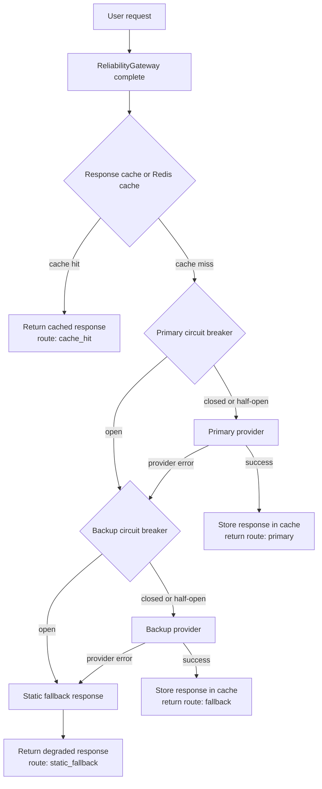

# Day 10 Reliability Final Report

## Architecture



## Configuration

| Parameter | Value | Rationale |
|---|---:|---|
| primary fail_rate | 0.25 | Baseline chaos includes a meaningfully flaky primary. |
| backup fail_rate | 0.05 | Backup is more reliable but not perfect, so static fallback remains tested. |
| failure_threshold | 3 | Opens after repeated failures without overreacting to one transient error. |
| reset_timeout_seconds | 2 | Lets the breaker recover during the load test window. |
| success_threshold | 1 | One successful probe closes HALF_OPEN for a short lab simulation. |
| cache backend | memory | Default run is local and reproducible; Redis is separately tested with Docker. |
| cache ttl_seconds | 300 | Keeps repeated sample queries hot during chaos runs. |
| similarity_threshold | 0.92 | Conservative threshold to reduce semantic false hits. |
| load_test.requests | 100 per scenario | Enough requests to trigger breaker/cache behavior quickly. |

## SLO Definitions

| SLI | SLO target | Actual value | Met? |
|---|---|---:|---|
| Availability | >= 99% | 99.33% | yes |
| Latency P95 | < 2500 ms | 313.91 ms | yes |
| Fallback success rate | >= 95% | 97.18% | yes |
| Cache hit rate | >= 10% | 63.00% | yes |
| Recovery time | < 5000 ms | 2454.69 ms | yes |

## Metrics Summary

These metrics are from the with-cache run stored in `reports/metrics.json`.

| Metric | Value |
|---|---:|
| total_requests | 300 |
| availability | 0.9933 |
| error_rate | 0.0067 |
| latency_p50_ms | 273.54 |
| latency_p95_ms | 313.91 |
| latency_p99_ms | 320.08 |
| fallback_success_rate | 0.9718 |
| cache_hit_rate | 0.63 |
| circuit_open_count | 7 |
| recovery_time_ms | 2454.6940326690674 |
| estimated_cost | 0.044844 |
| estimated_cost_saved | 0.189 |

## Chaos Scenarios

| Scenario | Expected | Observed | Status |
|---|---|---|---|
| primary_timeout_100 | Primary fails; backup handles most traffic. | fallback_success_rate stayed above 0.9. | pass |
| primary_flaky_50 | Circuit opens during failures and gateway still serves traffic. | circuit_open_count was non-zero and availability stayed above 0.8. | pass |
| all_healthy | Normal primary/cache path should dominate. | availability stayed above 0.9. | pass |

## Cache Comparison

The simulation was run twice with the same provider and circuit-breaker settings: once with cache enabled and once with cache disabled.

| Metric | With cache | Without cache | Difference |
|---|---:|---:|---:|
| total_requests | 300 | 300 | 0 |
| availability | 0.9933 | 0.9733 | +0.0200 |
| error_rate | 0.0067 | 0.0267 | -0.0200 |
| latency_p50_ms | 273.54 | 274.31 | -0.77 ms |
| latency_p95_ms | 313.91 | 315.28 | -1.37 ms |
| latency_p99_ms | 320.08 | 319.37 | +0.71 ms |
| fallback_success_rate | 0.9718 | 0.9621 | +0.0097 |
| cache_hit_rate | 0.63 | 0.0 | +0.63 |
| circuit_open_count | 7 | 23 | -16 |
| estimated_cost | 0.044844 | 0.12394 | -0.079096 |
| estimated_cost_saved | 0.189 | 0.0 | +0.189 |

Cache reduced provider calls, lowered estimated cost from 0.12394 to 0.044844, and reduced circuit-open events from 23 to 7. Median and tail latency changed only slightly because provider latency is still present on cache misses and the cache hit path records zero latency rather than a simulated network latency.

## Redis Shared Cache

In-memory cache is insufficient for multi-instance deployments because each process has a separate cache. A request cached by instance A would be invisible to instance B, reducing hit rate and increasing provider calls. `SharedRedisCache` solves this by storing query-response pairs in Redis with a shared key namespace and TTL.

### Redis-backed chaos run

The simulation was also run with `cache.backend = redis` using Docker Compose Redis on `localhost:6379`.

| Metric | Redis cache |
|---|---:|
| availability | 0.9933 |
| latency_p50_ms | 280.51 |
| latency_p95_ms | 318.62 |
| latency_p99_ms | 319.85 |
| fallback_success_rate | 0.9649 |
| cache_hit_rate | 0.7433 |
| circuit_open_count | 7 |
| recovery_time_ms | 2311.2339973449707 |
| estimated_cost | 0.03182 |
| estimated_cost_saved | 0.223 |

### Evidence of shared state

`tests/test_redis_cache.py::test_shared_state_across_instances` passed, proving two `SharedRedisCache` instances with the same Redis prefix can share data. Redis-specific test output was `6 passed`, and the full suite with Redis running was `35 passed, 7 xpassed`.

### Redis CLI output

```bash
$ docker compose exec -T redis redis-cli KEYS "rl:cache:*"
rl:cache:98332d0d1c9c
rl:cache:b2a52f7dc795
rl:cache:d354658dc020
rl:cache:095946136fea
rl:cache:3dab98c0e49e
rl:cache:da61fb49b4f6
rl:cache:734852f3cf4a
rl:cache:0bc3b1acf73d
rl:cache:dacb2b833659
rl:cache:fff10da1c72c
rl:cache:8baa2cfa11fa
rl:cache:9e413fd814eb
rl:cache:844ef0143a5c
```

## Cache And Safety Evidence

The cache uses word tokens plus character 3-gram cosine similarity. It skips privacy-sensitive prompts and logs suspected false hits when 4-digit years or IDs differ. The with-cache chaos run produced cache_hit_rate 0.63 and estimated_cost_saved 0.189.

## Failure Analysis

One remaining weakness is that recovery time depends on enough post-timeout probe traffic happening after a circuit opens. In a low-traffic production service, recovery could be delayed even if the provider is healthy again. Before production, I would add background health probes or adaptive probe scheduling and expose breaker state as metrics.

## Next Steps

1. Store circuit-breaker state in Redis so multiple gateway instances share failure counters.
2. Add background health probes to reduce recovery delay in low-traffic periods.
3. Add cost-aware routing that prefers cheaper providers or cache-only mode when budget is nearly exhausted.
